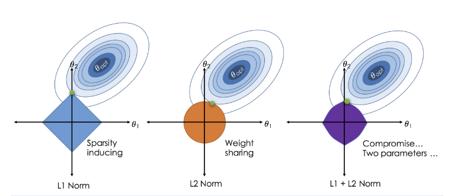

# Quantitative Regularization in Linear Regression

## Objective  
This notebook models and tests the **four key estimators** in linear regression:  
**Ordinary Least Squares (OLS)** ; **Ridge (L2)** ; **Lasso (L1)** ; **ElasticNet (L1 + L2)**.  
Starting from the classical OLS formulation, we progressively introduce regularization terms and study their **mathematical derivations**, **gradient minimization steps**, and **quantitative impacts**.  

While `scikit-learn` performs these optimizations internally, we explicitly derive the **cost functions**, **partial derivatives (∂)**, and **optimality conditions** to understand what happens *inside the black box*.

---

## Gradient Principle  

At the heart of all optimization problems lies the **additivity of derivatives**:  
if a cost function is composed of two differentiable parts,
L(θ) = f(θ) + g(θ)

then its gradient satisfies:

∂L(θ)/∂θ = ∂f(θ)/∂θ + ∂g(θ)/∂θ

This rule allows us to decompose each regularized regression objective into:
- a **data-fitting term** $f(\beta) = \|y - X\beta\|_2^2$
- and a **penalization term** $g(\beta) = \lambda \|\beta\|_p^p$,  
    where $p = 1$ (Lasso) or $p = 2$ (Ridge).

The total derivative is thus:
$$\frac{\partial J(\beta)}{\partial \beta}
= \frac{\partial}{\partial \beta}\|y - X\beta\|_2^2
+ \frac{\partial}{\partial \beta}\big[\lambda \|\beta\|_p^p\big]$$
and the **first-order optimality condition**
$$\frac{\partial J(\beta)}{\partial \beta} = 0$$
defines the analytical or subgradient solutions for OLS, Ridge, Lasso, and ElasticNet.

---

## Mathematical Framework  

We consider the generalized penalized least squares problem:
$$\min_{\beta} \; J(\beta) = \|y - X\beta\|_2^2 + 
\lambda \big[(1-\gamma)\|\beta\|_2^2 + \gamma\|\beta\|_1\big]$$
where  
- $\lambda > 0$ controls the **regularization strength**,  
- $\gamma \in [0,1]$ interpolates between Ridge (γ=0) and Lasso (γ=1).

---

### 1. Ordinary Least Squares (OLS)
$$J(\beta) = \|y - X\beta\|_2^2$$
Minimization condition:
$$\frac{\partial J}{\partial \beta} = -2X^\top(y - X\beta) = 0
\Rightarrow \hat{\beta}_{OLS} = (X^\top X)^{-1}X^\top y$$
OLS minimizes only the residual sum of squares → **unbiased** but **unstable** under multicollinearity.

---

### 2. Ridge Regression (L2 Regularization)
$$J(\beta) = \|y - X\beta\|_2^2 + \lambda\|\beta\|_2^2$$
Setting the derivative to zero:
$$\frac{\partial J}{\partial \beta} = -2X^\top(y - X\beta) + 2\lambda\beta = 0
\Rightarrow (X^\top X + \lambda I)\hat{\beta}_{Ridge} = X^\top y$$
Ridge adds an L2 penalty that **shrinks coefficients** and **reduces variance**.

---

### 3. Lasso Regression (L1 Regularization)
$$J(\beta) = \|y - X\beta\|_2^2 + \lambda\|\beta\|_1$$
Since $|\beta|$ is not differentiable at zero, we use **subgradients**:
$$\frac{\partial J}{\partial \beta_j} = -2x_j^\top(y - X\beta) + \lambda \, \text{sign}(\beta_j)$$
At the minimum:
$$0 \in \frac{\partial J}{\partial \beta_j}
\Rightarrow \text{some } \hat{\beta}_j = 0$$
Lasso performs **automatic variable selection** by setting some coefficients exactly to zero.

---

### 4. ElasticNet (L1 + L2 Regularization)
$$J(\beta) = \|y - X\beta\|_2^2 + 
\lambda \big[(1-\gamma)\|\beta\|_2^2 + \gamma\|\beta\|_1\big]$$
Gradient with respect to β:
$$\frac{\partial J}{\partial \beta} = 
-2X^\top(y - X\beta) + 2\lambda(1-\gamma)\beta + \lambda\gamma\,\text{sign}(\beta)$$
ElasticNet blends **Lasso's sparsity** and **Ridge's stability**, making it robust under correlated predictors.

---

## Methods  
1. **Feature standardization** (mean = 0, std = 1) to ensure homogeneous penalization.  
2. **K-fold cross-validation** to find optimal $\lambda$ and $\gamma$.  
3. **Model comparison**: OLS, Ridge, Lasso, ElasticNet on both **synthetic** and **real (Diabetes)** datasets.  
4. **Analytical vs algorithmic** perspective:  
     - explicit gradient derivations (∂J/∂β = 0),  
     - empirical results using `scikit-learn`.  
5. **Evaluation metrics:** MSE, RMSE, and coefficient behavior under increasing regularization.

---

## Main Takeaway  
By moving from OLS ; Ridge ; Lasso ; ElasticNet,  we demonstrate mathematically and empirically how the **partial derivatives (∂J/∂β)** evolve with each penalty,   how **λ** and **γ** reshape the cost landscape,  and how regularization enhances **numerical stability**, **predictive robustness**, and **interpretability**.
